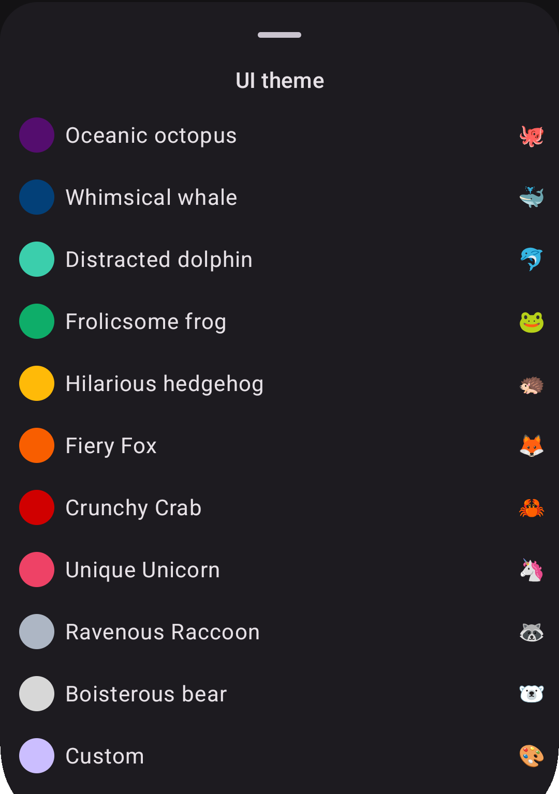

Localization and customization are first-class citizens at
Procyon, [as already discussed](2025-06-20-i10n-and-l10n-challenges.md). An feature in which they
come together is the choice of the color theme to apply to the app.

In Compose Multiplatform, we have an amazing library to generate color palettes with different
styles (more or less playful, vibrant, etc.) base on a seed color,
called [MaterialKolor](https://github.com/jordond/MaterialKolor).

In order to select the base color to generate the palette, I wanted to be able to let user insert a
custom value, but also to make it possible to choose from a preset.

Instead of just displaying the colors and maybe the hex code in the preview, I decided to name
themes based on an animal and to create noun-adjective alliterating pair, where both words started
with the same syllable onset (or at least written with the same letter).

<div align="center">
    
</div>

When translating this into languages other than English, I tried to retain the play on words and
specified instructions for it on Weblate for collaborators.

When these instructions were respected, the result was indeed quite funny:

**Italian**
```xml
<string name="theme_color_blue">Balena ballerina</string>
<string name="theme_color_gray">Procione pasticcione</string>
<string name="theme_color_green">Rana rilassata</string>
<string name="theme_color_light_blue">Delfino distratto</string>
<string name="theme_color_orange">Volpe virtuosa</string>
<string name="theme_color_pink">Unicorno unico</string>
<string name="theme_color_purple">Piovra portentosa</string>
<string name="theme_color_red">Granchio galante</string>
<string name="theme_color_white">Orso originale</string>
<string name="theme_color_yellow">Riccio rampante</string>
```

**Spanish**
```xml
<string name="theme_color_blue">Ballena bailarina</string>
<string name="theme_color_gray">Mapache maloliente</string>
<string name="theme_color_green">Rana relajada</string>
<string name="theme_color_light_blue">Delfín distraído</string>
<string name="theme_color_orange">Zorro zancudo</string>
<string name="theme_color_pink">Unicornio único</string>
<string name="theme_color_purple">Pulpo portentoso</string>
<string name="theme_color_red">Cangrejo crujiente</string>
<string name="theme_color_white">Panda peludo</string>
<string name="theme_color_yellow">Erizo errante</string>
```

**German**
```xml
<string name="settings_theme_color_blue">Witziger Wal</string>
<string name="theme_color_gray">Wildgewordener Waschbär</string>
<string name="theme_color_green">Fröhlicher Frosch</string>
<string name="theme_color_light_blue">Desorientierter Delfin</string>
<string name="theme_color_orange">Feuriger Fuchs</string>
<string name="theme_color_pink">Einzigartiges Einhorn</string>
<string name="theme_color_purple">Ozeanischer Oktopus</string>
<string name="theme_color_red">Knusprige Krabbe</string>
<string name="theme_color_white">Brabbelnder Bär</string>
<string name="theme_color_yellow">Irrsinniger Igel</string>
```

**French**
```xml
<string name="theme_color_blue">Baleine balourde</string>
<string name="theme_color_gray">Raton-laveur rapide</string>
<string name="theme_color_green">Grenouille gaffeuse</string>
<string name="theme_color_light_blue">Dauphin distrait</string>
<string name="theme_color_orange">Renard raisonnable</string>
<string name="theme_color_pink">Licorne lunatique</string>
<string name="theme_color_purple">Pieuvre pantouflarde</string>
<string name="theme_color_red">Crabe croquant</string>
<string name="theme_color_white">Ours ouaté</string>
<string name="theme_color_yellow">Hérisson hilarant</string>
```

In some other languages, though, the same effect was not retained and only occasionally the
alliteration is preserved, e.g. in Finnish the red theme 🦀 is "Rapea rapu" or in Russian the purple 
theme 🐙 is rendered as "Океанический осьминог".

---

_Do you want to help improving the existing translations or add a new one? Join our Weblate projects
([here](https://hosted.weblate.org/engage/raccoonforlemmy) and [here](https://hosted.weblate.org/engage/raccoonforfriendica))!_