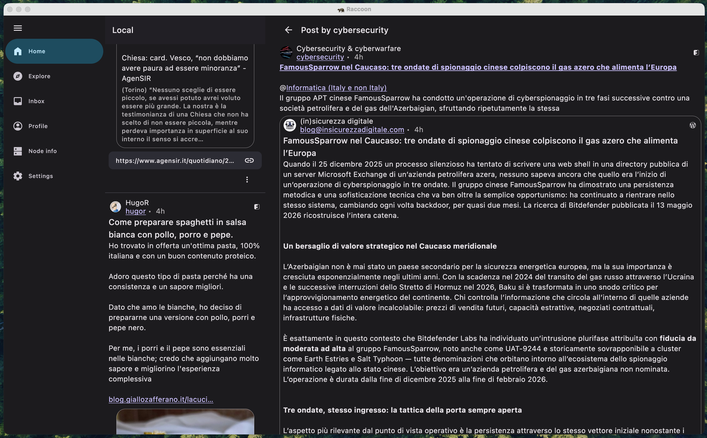

*Published on May 15, 2026*

## What are Window Size Classes?

Material Design 3 has introduced the concept of **Window Size Classes** to help developers abstract
away the overwhelming variety of device viewports. Instead of designing for multiple specific
screen resolutions, we can categorize available space into three opinionated buckets: **Compact**,
**Medium**, and **Expanded**.

According to the
[official documentation](https://developer.android.com/develop/ui/compose/layouts/adaptive/use-window-size-classes){ target = _blank }, window size classes provide a bridge between designer-friendly breakpoints and
developer-centric implementation. They allow us to focus on how the UI should transition between
different states rather than worrying about specific pixel counts.

This is especially critical in a project like Raccoon, which targets multiple platforms (Android,
iOS, and desktop) where available screen real estate can change in a heartbeat.

## Multiplatform Implementation

In a KMP project, querying the current window size class requires platform-specific implementations.
We can leverage the `expect`/`actual` mechanism to provide a clean, unified API to our common code:

* **Platform-specific query logic**: Android requires an `Activity` context, while iOS and JVM can
  query window bounds directly.
* **Shared utilities**: We keep our business logic DRY by placing the observation and reaction logic
  in `commonMain`.

### Code Snippets

To obtain the current window size class and react to its changes dynamically:

```kotlin
// in commonMain
@Composable
expect fun getWindowSizeClass(): WindowSizeClass?

// in the androidMain source set
@Composable
actual fun getWindowSizeClass(): WindowSizeClass? {
    val activity = LocalActivity.current
    checkNotNull(activity) { return null }
    return calculateWindowSizeClass(activity)
}

// in iosMain
@Composable
actual fun getWindowSizeClass(): WindowSizeClass? {
    return calculateWindowSizeClass()
}

// in jvmMain
@Composable
actual fun getWindowSizeClass(): WindowSizeClass? {
    return calculateWindowSizeClass()
}
```

Once we have the size class, we can create shared utilities to make our UI code more readable:

```kotlin
// all in the commonMain source set
@Composable
fun isWidthSizeClassEqualOrAbove(other: WindowWidthSizeClass): Boolean {
    val current = getWindowSizeClass()?.widthSizeClass ?: WindowWidthSizeClass.Compact
    return current >= other
}

@Composable
fun isWidthSizeClassBelow(other: WindowWidthSizeClass): Boolean {
    val current = getWindowSizeClass()?.widthSizeClass ?: WindowWidthSizeClass.Compact
    return current < other
}
```

## A Strategy for Adaptive Layouts

Following established best practices, I chose the **Expanded** width as our primary breakpoint for
structural layout changes. Here’s how the experience shifts across devices:

### Compact & Medium Screens

On smaller form factors, I prioritize reachability and density:

* **Bottom Navigation**: Main sections are nested here for quick thumb access.
* **Modal Navigation Drawer**: Reserved for secondary features and settings.
* **Floating Action Buttons**: Tucked into the traditional bottom-right corner.

### Expanded Screens

When we have the luxury of space on tablets and desktops, we can reduce navigation depth
significantly:

* **Permanent Navigation Drawer**: Replaces the bottom bar with a collapsible side panel.
* **Top Bar Actions**: Common shortcuts migrate to the top bar for better visibility.
* **Multi-Pane Scaffolds**: We move beyond single columns to leverage the full width.

Interestingly, since Raccoon features more than seven primary destinations, a standard **Navigation
Rail** (the MD3 go-to for side navigation) wasn't feasible. This pushed us toward a more custom,
collapsible drawer approach that maintains usability without clutter.

## Leveraging Canonical Layouts

A cornerstone of Material Design 3 is the use of
[Canonical Layouts](https://developer.android.com/develop/ui/compose/layouts/adaptive/canonical-layouts){ target = _blank }. These are battle-tested patterns—like **List-Detail**, **Supporting Pane**, and *
*Feed**—that provide a rock-solid foundation for adaptive applications.

In practice, this means reaching for specialized components like `ListDetailPaneScaffold` or
`SupportingPaneScaffold`. When paired with sub-navigators like `ThreePaneScaffoldNavigator`, they
unlock sophisticated navigation flows where "master" and "detail" views can seamlessly coexist or
stack depending on available width—complete with beautiful, built-in animated transitions!

Adopting this approach often implies maintaining two distinct navigation graphs: one optimized for
compact/medium screens and another for expanded layouts. A real-world example of this in Raccoon is
the [TimelineWithEntryDetailScreen](https://github.com/LiveFastEatTrashRaccoon/RaccoonForFriendica/blob/8498d5f4cfa99f3c584c8109e760e061d75c8f07/shared/src/commonMain/kotlin/com/livefast/eattrash/raccoonforfriendica/adaptive/TimelineWithEntryDetailScreen.kt#L4){ target = _blank }, which dynamically reconfigures its internal structure on the fly.

<figure markdown="span">
    
    <figcaption>A screenshot of timeline / detail two-pane scaffold.</figcaption>
</figure>

## Multiplatform and Beyond

This effort went hand-in-hand with adding support for the JVM target for the desktop app. By
adopting window size classes, adding a completely new platform was remarkably smooth. The UI
simply "snapped" into place once the desktop window bounds were mapped to the correct size classes.

## Looking Ahead: Navigation 3

While the current approach of maintaining separate navigation graphs works well, the future of
adaptive navigation in Compose looks even more promising. The upcoming
[Navigation 3](https://developer.android.com/guide/navigation/navigation-3){ target = _blank }
library introduces the concept of **Scenes** and **Scene Strategies**.

These allow developers to define how a destination should be displayed (e.g., as a full-screen pane,
a detail pane, or even a bottom sheet) based on the current window size class, all without having to
duplicate destination logic. It effectively abstracts the "where" and "how" of navigation away from
the "what".

As of now, Navigation 3 is still in its early stages and might not be mature enough for
production-heavy apps like ours.  So I've decided to wait until the library stabilizes further, but
the migration path is definitely on my radar. 

!!! question
    Who knows? Maybe future update could see Raccoon powered by these new scene-based strategies!

*[KMP]: Kotlin Multiplatform
*[API]: Application Programming Interface
*[JVM]: Java Virtual Machine
*[DRY]: Don't Repeat Yourself
*[UI]: User Interface
*[UX]: User Experience
*[MD3]: Material Design 3
