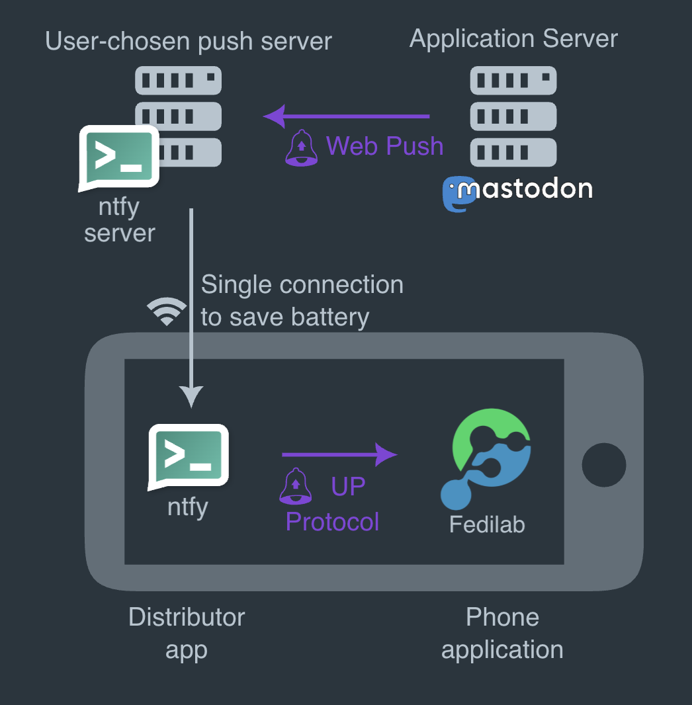

## The Beginning: a Missing Feature

One of the most common complaints during Raccoon's first year of development, and a major reason why
some early adopters jumped ship, was the lack of support for push notifications.

It's a fair critique, but what many users didn't realize is that push notifications aren't just a
simple, client-side switch you flip. As the name suggests, notifications must be "pushed" to devices
by an external service the moment an event occurs.

To understand why this was such a hurdle for Raccoon, we first need to look at how traditional push
notifications work.

## Anatomy of Push Notifications

The standard architecture for push notifications is a three-way dance involving the client device,
the backend instance, and a third-party messaging relay acting as the "man in the middle".

Here is how they interact:

- **Client Application:** the app registers with a third-party messaging service—usually tied
  directly to the mobile operating system, like APNS for iOS or FCM for Android. The device obtains
  a unique "push token" for that specific app installation and sends it to the backend via an
  authenticated endpoint.

- **Application server:** the backend stores these tokens and links them to the correct user
  account. Whenever an event triggers a notification (based on the user's preferences), the backend
  makes a server-to-server call to the messaging relay.

- **Messaging Relay:** this service takes the backend's request and dispatches the message to
  the device on a "best-effort" basis (handling edge cases like offline devices, app badges,
  priority levels, custom sounds, etc.).

In short: the client app handles tokens and incoming messages, the application server manages user
preferences and triggers, and the messaging service handles the complex, platform-specific delivery.

## The Open Source Dilemma

While this architecture works flawlessly for centralized corporate apps, the rules change entirely
when you build for open-source networks and the Fediverse.

Raccoon has been strongly committed to zero reliance on closed-source, proprietary
third-party libraries, otherwise I would not even be able to distribute the app through F-Droid.
That immediately rules out standard integrations with FCM and APNS.

Then, I discovered UnifiedPush.

## Decoupling the "Man in the Middle"

[UnifiedPush](https://unifiedpush.org){ target=_blank } is based on a slightly different paradigm.
Instead of a single, proprietary monolith, it splits the middleman into two separate components:

- **Push Server:** it receives events directly from the application server through the WebPush open
  protocol;[^1]
- **Distributor:** an app installed on the device which delivers those notifications to individual
  apps through the UP protocol.

So, together with the application server and the client app, there are totally four components
involved:

<figure markdown="span">
    { width=500 }
    <figcaption>Diagram of the interactions between components with UnifiedPush.</figcaption>
</figure>

In this scenario, the client app registers in onto the distributor. The latter contacts the push
server to create an endpoint. Once obtained, the endpoint is delivered back to the client app, which
transmits it to the application server which stores the endpoint data associated to the user.

When a notification needs to be sent, the application server sends a message to the endpoint
it has stored, which points to the push server. The push server processes the message and the
distributor, which is subscribed for messages on the push server, proxies the notifications to the
client app.

Decoupling the push server and the distributor allows for more flexibility: you are free to use
whatever technology best suits you. E.g. on the server side you can choose a self-hosted server like
[ntfy.sh](https://github.com/binwiederhier/ntfy){ target=_blank } or
[NextPush](https://codeberg.org/NextPush){ target=_blank } which integrates with NextCloud, 
[SunUp](https://unifiedpush.org/users/distributors/sunup){ target=_blank }, etc. whereas on the 
client-side you can use the their counterparts of ntfy and SunUp on Android or dedicated apps (e.g. 
[KUnifiedPush](https://unifiedpush.org/users/distributors/kunifiedpush){ target=_blank } on Linux).

[^1]: If the target platform's server is not directly compatible, Push Gateways are available too.

## The Breakthrough: Friendica Notifications

Implementing this on Android turned out to be a game-changer. Thanks to the UnifiedPush Android SDK,
Raccoon can seamlessly configure distributors, detect when new ones are installed, and let the user
choose their preferred routing.

!!! tip "Recommendation"
    If you are setting this up on Android, I highly recommend using
    [Sunup](https://unifiedpush.org/users/distributors/sunup){ target=_blank } as your distributor.
    It is incredibly easy to set up and completely frictionless to use.

The result?

Finally, fully working, privacy-respecting push notifications! With this major milestone
ticked off the list, there's officially one excuse less to prefer other Fediverse clients. 😂 🦝

## References

- [Official UnifiedPush website](https://unifiedpush.org)
- [Guida a UnifiedPush su Mastodon, Matrix e Telegram](https://noblogo.org/filippodb/mai-piu-notifiche-da-google-guida-a-unified-push-su-mastodon-matrix-e-telegram){ target=_blank }
- [UnifiedPush: notifiche push decentralizzate e open source](https://www.novemila.org/unifiedpush){ target=_blank }

*[APNS]: Apple Push Notification Service
*[FCM]: Firebase Cloud Messaging
*[SDK]: Software Development Kit
*[UP]: Unified Push

