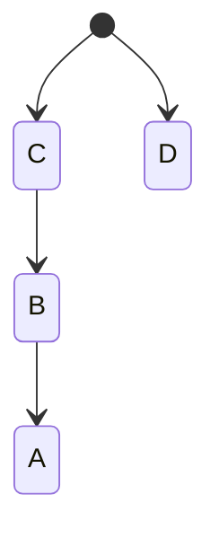
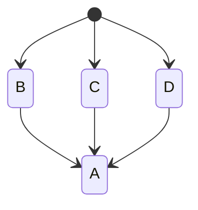

*Published on June 06, 2026*

Raccoon apps are Gradle projects, meaning that all tasks (compilation, verification, packaging) are
orchestrated by a tool called [Gradle](https://gradle.org). In this article we will explore the
relationships between build system and project structure, discuss why some architectural choices
are better and how to configure builds so that the tool works for you (and not *vice versa*).

## What is Gradle?

Gradle is a general-purpose tool for projects written in Java, C++, Scala, JavaScript, Groovy and
Kotlin or any combination thereof. It is an extremely powerful tool, suited for enterprise-scale
projects (backend or full stack applications, Android apps, KMP apps and so on). It is designed for
extensibility, with a wide range or third party plugins which make it very flexible and adaptable,
at the cost of a quite steep learning curve. Setting it up correctly is just the first step, being
able to analyze build traces, identify errors and fix them indeed takes some years of seniority.

Nonetheless, Gradle is still the *de facto* standard for Android and KMP projects as of 2026, even
if there are alternatives. For example the [Kotlin toolchain](https://kotlin-toolchain.org/dev),
backed by JetBrains itself, is very promising and, personally, I foresee that in the future the
community will gravitate towards leaner and more specialized tools like that.

!!! info
    Gradle is deeply integrated into the Android ecosystem (e.g. with AGP), so it will
    likely remain the requirement for Android-specific packaging in the foreseeable future.

## Build Nightmares

If Gradle is not configured properly, there are several downsides. The most obvious one is a build
failure, which can give some headaches but at least you realize immediately that something is wrong.

But there are more subtle ones: for example its performance may degrate significantly, and as the
project grows you end up wasting more time waiting for builds to finish rather than actually working
on the project.

Or, which is worse to me, your build config becomes unmaintainable. As technology evolves or plugins
are added, you end up with lots of interconnected yet sparse build scripts and config files
scattered in your source tree. Each new change may be incompatible with other ones and break
everything at the least expected moment in an endless dependency nightmare.

## Our Recommended Approach

Now, let's move into the solution space. To control build times, the most important thing is to
avoid running unnecessary steps and caching results from already performed steps to reuse them in
subsequent builds. This is a wide topic and would require several chapters to properly discuss it.

However, the key idea is that building a project is a sequence of interconnected tasks, where the
output of each one may be the input for another one. This concept in CS is commonly referred
to as a "pipeline", and all built tools from the early days work in this way (GNU Make, Apache ant,
Maven, etc.).

Since tasks are deterministic, if all the inputs of a task are unchanged, its output will be
unchanged too so it may be skipped. So, for example, if the sources of a specific compilation unit
are not changed from a previous run, the corresponding binary does not need to be recreated. But
sources are not the only input of the build step of a given unit, it may also depend on the APIs of
other units and if those are changed the current one is affected too.

The key to avoid unnecessary passes is to isolate the project in discrete components with
well-defined rules about which units depend on which other ones in order to minimize coupling
and, therefore, the amounts of rebuilds whenever changes occur.

### Modularization

In Gradle projects, this boils down modularization strategies. Every Gradle project consists of a
root project, i.e. the container project which results in the main artifact when the build
is completed (this may be a .ear, .war, .jar, .apk or whatever package depending on the applied
plugins) and one or more subprojects whose build outputs are assembled into the main artifact. So,
the assemble task of the root projects depends on the output of the assemble task of each
subproject.

"Depending" in this sense has two negative consequences affecting build times:

- the dependant task needs to wait until all its dependees have completed;
- every time a dependency changes, the dependant is invalidated and needs to rerun.

Building each subproject can happen in parallel, so having more than one is usually beneficial in
modern multicore architectures. However, if there are dependencies between subprojects, the two
aforementioned consequences for each dependant apply.

If subprojects are seen as nodes and a dependency is a directed edge pointing from the dependant to
the dependee, Gradle projects have the form of a DAG, implying that all builds end
sooner or later (no cycles).

But some configurations are worse than others for performances. Let's consider the following
configuration for example:

<figure markdown="span">

<figcaption>Diagram illustrating the "chain" configuration.</figcaption>
</figure>

where we see that for the build to complete C and D are needed, but C needs B to complete, and B
needs A to complete in turn. This means that A, B and C can not be run in parallel and that each
change in A affects B, C and the overall result.

Let's also consider the following scenario:

<figure markdown="span">

<figcaption>Diagram illustrating the "fan-out" configuration.</figcaption>
</figure>

Here we successfully decoupled B, C and D so that they can run in parallel, which is good. But they
all depend on A so that each change in A determine that every other module is affected and must be
recompiled.

Modularizing in the correct way allows to minimize the occurrences of situations like these. There
is a consensus among mobile developers that modularization by feature is the best one to avoid
unwanted entanglements between different parts of the app, rather than isolate modules by layer.

However, each project has its needs and each developer has their opinion, so a balance needs to be
found. In Raccoon, I decided to divide projects in three kinds:

- **core** modules: reusable pieces of software that provide the foundational layer for all
  other ones. Each of them should not depend on any other module ideally, but if it really has to,
  it can only be on some special core modules with the least amount of outgoing edges (e.g.
  `:core:di`, `:core:l10n` or `:core:preferences`). They are divided logically by the functionality
  they provide (except `:core:utils`).
- **domain** modules: contain the model and business logic and are roughly divided by area, e.g. the
  classes related to identity, the ones related to remote contents, and so on. Here the
  criterion is more layer-centered than feature-centered (e.g. content-related data models are in a
  single module) but for practical reasons, because application logic and domain models are not
  changing so frequently in this kind of project. Domain modules can depend only on core modules.
- **feature** modules: contain the presentation logic and they are strictly divided by feature. As
  a matter of fact, there is almost a 1:1 relationship between each subproject and each app screen.
  Feature modules can depend on core and domain modules, but not on any other feature.[^1]

[^1]: This requires some careful design for navigation, because navigation between screens must be 
totally decoupled. In Raccoon I used a `:core:navigation` module and abstracted away the underlying 
navigation system (I actually migrated from Voyager to Compose Navigation and I am willing to 
migrate to Navigation 3 soon).

### Convention plugins

Splitting a project into multiple subprojects comes with some configuration overhead. Each
subproject needs its build script with its applied plugins, its dependencies, its configuration.
Some parts of the build scripts are common to all modules, some are "more equal" than others (e.g.
all modules having a UI need the Compose compiler plugin applied and include Compose dependencies),
etc.

For external library versions, there is an out-of-the-box solution already offered by Gradle: 
**Version Catalogs** which allow to centralize in a single source of truth all the dependency 
versions.

The solution I decided to adopt for common configuration is known as **Convention Plugins**,
i.e. isolating the repeated bits of build configuration – e.g. applying some Gradle plugins or
including some dependencies which always go together or configure a plugin in some way e.g. for
running tests.

This way it is simpler to make changes, because you have to only change the definition of the plugin
to automatically adapt dozens of subproject in a row; which was extremely beneficial in situations
like the [AGP 9.x migration](2026-05-17-dealing-with-kmp-shifting-sands.md).

The main custom plugins I wrote are:

- `com.livefast.eattrash.kotlinMultiplatform` to be applied in all modules to apply and configure
  the `org.jetbrains.kotlin.multiplatform` and `com.android.kotlin.multiplatform.library` plugins;
- `com.livefast.eattrash.composeMultiplatform` to be applied in all UI related modules to apply and
  configure the `org.jetbrains.compose` and `org.jetbrains.kotlin.plugin.compose` plugins;
- `com.livefast.eattrash.test` and `com.livefast.eattrash.uiTest` to configure host tests and device
  tests.

## Wrap-up

I consider that the ability to spot and avoid pitfalls is crucial in order to maintain a high
quality of developer experience, not only user experience; and working on Raccoon one has
been a great training ground which allowed me to become a better developer for my work IRL.

Identify common parts (even in configuration, not only in logic) and factor them out to reusable
pieces of code is an application of the DRY principle; it saves a lot of time which can be dedicated
to work on more valuable activities.

Plus, it taught me not to "fear" Gradle and better understand the tools I use in my everyday life,
even at work and not only in side projects.

!!! question
    What is your experience with Gradle? Did you come to similar solutions or do you have futher
    recommendations? Let me know!

*[KMP]: Kotlin Multiplatform
*[API]: Application Programming Interface
*[CS]: Computer Science
*[DAG]: Directed Acyclic Graph
*[AGP]: Android Gradle Plugin
*[IRL]: In Real Life
*[DRY]: Don't Repeat Yourself