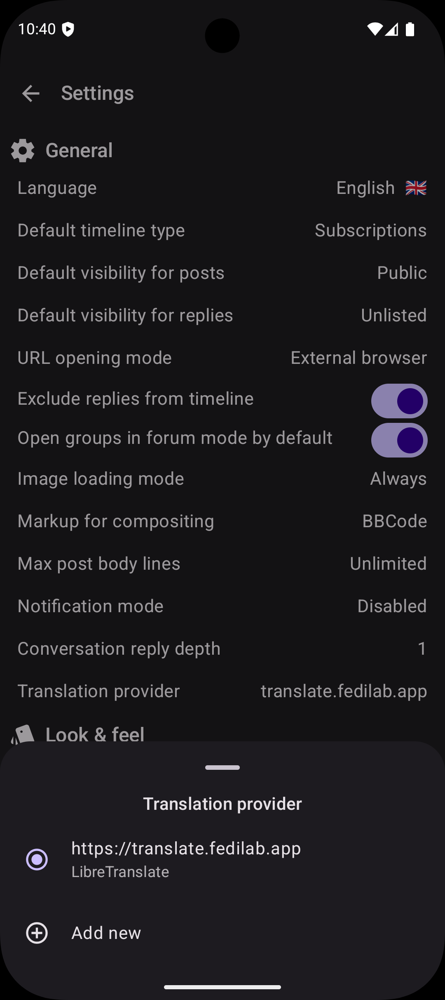

*Published on June 11, 2026*

## The Multilingual Reality of ActivityPub

The Fediverse is built on the promise of decentralized, equal communication. However, when users
from different instances federate, they often encounter a barrier that code alone can not fix:
language. While global connectivity is built into the protocol, making sense of foreign content
often requires external tools that many servers do not provide.

## Why Server-Side Translation is Rare

Services like Mastodon are designed to integrate with translation providers, so that users can
toggle on-demand translation for posts appearing in their timelines.

This integration is not automatic, though, it has to be explicitly configured by instance
administrators:

- if requests are routed to an external provider (such as [DeepL](https://www.deepl.com) or a
  [LibreTranslate](https://libretranslate.com) instance), admins have to configure an API key and
  pay the costs for translations;
- alternatively, since LibreTranslate is a self-hostable FOSS appliance, it can be
  installed on a server they already own (even the same hosting the instance), but they still need
  to pay for used resources.

As a result, not many instances (especially smaller ones) offer server-side translation, as they
are run by volunteers who already run instances at their own expenses, often on a not-so-generous
budget.

A growing user base already means more storage and computational resources are needed just for
content management, so it is no surprise that translation is an expense worth sacrificing.

## Empowering Clients

A possible solution to this is managing translation on the client-side. This doesn't necessarily
mean running a local AI model on-device; while privacy-preserving, the large download size and high
memory demands can be a dealbreaker for many mobile users.

A more flexible approach is allowing users to connect to their preferred translation service
directly. By sending requests to a user-configured LibreTranslate instance and using
their own API key, the cost and quota management are decentralized.

This removes the financial burden from instance admins while giving users control over their data.
They can choose their trusted service and have their saying in whom data is sent to.

This is the path may apps have taken, including Raccoon. In the settings screen it is possible to
configure one or more translation providers and choose the default one.

<figure markdown="span">
  { width=400 }
  <figcaption>Translation provider configuration bottom sheet.</figcaption>
</figure>

For now the only supported provider is LibreTranslate: its configuration require the user to enter 
the instance URL and their API key (most instances require one).

Once a translation provider has been selected, the options menu in each post whose language
is not the current one,[^1]  contains an option to toggle translation. When selected, the original
content is swapped with the translation and the drop-down menu option allows to switch back to the
source version.

## A Bit of History

Getting this right was not an overnight process. Before integrating with LibreTranslate I
experimented with another third-party service (see
[#746](https://github.com/LiveFastEatTrashRaccoon/RaccoonForFriendica/pull/746)) but the output was
very low quality. Users complained, I listened to their feedback and decided to remove it.

The new architecture implemented in
[#1176](https://github.com/LiveFastEatTrashRaccoon/RaccoonForFriendica/pull/1176) is built on two
core principles: **user choice** and **extensibility**.

It is flexible enough to let users configure more than one service and extensible enough so
developers can add other implementations for different providers (local or remote).

!!! question
    How do you currently handle posts in languages you don't speak? Do you rely on your instance’s
    built-in tools, or do you find yourself copy-pasting into external browser? 
    Let's talk about how we can make the Fediverse feel more like a global neighborhood.

*[API]: Application Programming Interface

[^1]: The current language corresponds to the app's on (from Settings), the
post's one corresponds to its `language` property.