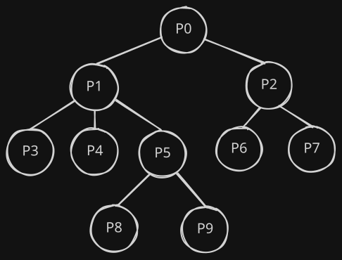
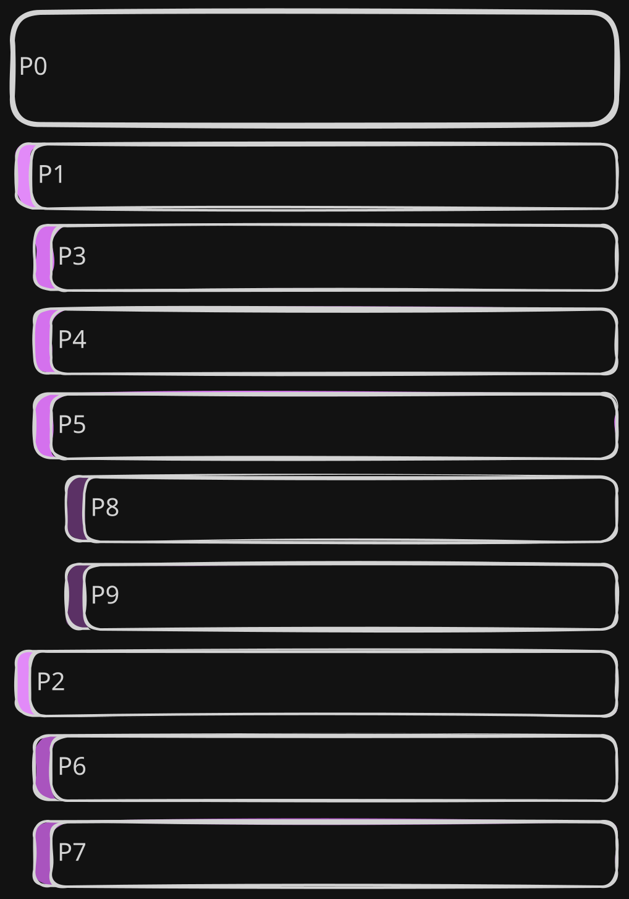
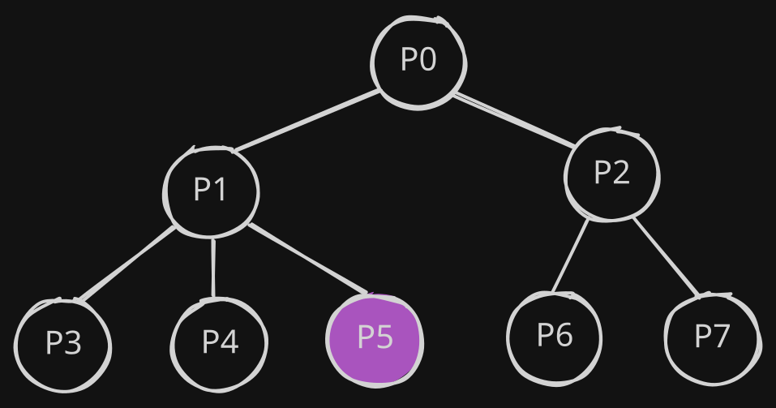

*Published on July 04, 2026*

In [Part 1](2026-06-29-ap-groups-part-1.md) we described what a group is and how its contents are
displayed in the so-called "Forum Mode" in Raccoon. As a quick reminder, the main page contains the
list of first-level posts re-shared by the group, which roughly correspond to classic forum
"threads".

Each thread can be opened to access its detail screen containing the discussion. The thread detail
screen has the following layout: the initial post by the OP is displayed at the top and replies
appear below.

In this article we will explain how the raccoon proceeds to "dig though the trash" and go deeper and
deeper in the discussion thread.

## The Family Tree

In a discussion each element has exactly one parent, except for the initial post which has none and
is the common ancestor of all others.

In Computer Science, this data structure is called a **tree**, where the initial post is the root
node. This means that conversations are intrinsically hierarchical, where the context of each post
is made up of:

- its parent and ancestors up to the root node;
- its children and descendants below it.

<figure markdown="span">
  { width=400 }
  <figcaption>Underlying representation of replies as a tree.</figcaption>
</figure>

## Making Threads Look Good

In order to follow a discussion as a reader and writer, it is important to quickly identify two
types of relationships:

- who is answering to whom, i.e. **parents and children**;
- posts on the same level because they have the same parent, i.e. **siblings**.

In order to guide the user in identifying these, two visual elements are introduced:

- **visual offset**: posts are progressively indented according to their depth level;
- **comment bar**: a colorful bar is displayed laterally with the full height of the post body, so
  that posts of the same level can be easily identified.[^1]

<figure markdown="span">
  { width=400 }
  <figcaption>Visual representation of replies as a list.</figcaption>
</figure>

## Completeness is Key

Reply trees can grow indefinitely (both in *breadth* and *depth*) and, it is very important to make
sure that:

- no unneeded extra data is downloaded: more data means more time to load as well as more bandwidth,
  memory and power consumption;
- at the same time, if each data fetch is partial, not too many requests are done to the instance,
  to avoid overloading servers.

As anticipated in part 1, Mastodon APIs offer an endpoint to fetch the context of a post:
[GET `v1/statuses/:id/context`](https://docs.joinmastodon.org/methods/statuses/#context){ target=_blank }.
On Mastodon instances, the resulting context is capped to 40 ancestors and 60 descendants with a max
depth of 20 for unauthenticated requests, 4096 ancestors and 4096 descendants with unlimited depth
for authenticated requests.

!!! warning "API Considerations"

    Unfortunately, on Friendica this API has historically always been problematic. Friendica is 
    built to **aggregate different networks and protocols** (ActivityPub, Diaspora, RSS feeds, etc.).
    Probably due to the more complex DB structure, results of the context API are kwnown to be
    truncated, with some reply branches entirely missing.

In order to overcome this issue, the only solution was to populate the tree manually. As an example,
let's imagine "`P0"`, `"P1"`, etc. to be the post IDs. Let's also assume that response for a GET 
`v1/statuses/P0/context` would be the following JSON, where descendants are truncated at the first
level:

```
{
  "ancestors": [],
  "descendants": [
    {
      "id": "P1",
      "replies_count": 3,
      // ...
    },
    {
      "id": "P2",
      "replies_count": 2,
      // ...
    }
  ]
}
```

We know that the post has no ancestors and has two descendants, one of which with three replies. 
In order to reconstruct the rest of the tree, we need to: iterate over all descendants having a
reply count greater than zero (non-leaves), collect their first-level descendants, then proceed 
downwards in all subtrees recursively until leaves are reached in every path. 

In the process, it is important that we keep track the **depth** of each post, in order to properly
indent them in the layout and for another reason we'll discuss later.

Considering that conversations can grow indefinitely, another condition should be imposed:
stop fetching data when a threshold depth is reached, to avoid overloading the server with too
many requests and fetching data that the reader may not even be interested to see. The depth
property we have been calculating earlier may be useful with this respect.

Since the tree we manipulate is incomplete, we also need to be able to identify those "pruning
points" and be able to load the remaining subtree (on-demand) at a later point. Again, the depth
property we have been calculating can be used, in conjunction with the reply_count we get from the
server.

### Step 1: Grow the Tree

```kotlin linenums="1"
private data class Node(
    val entry: TimelineEntryModel,
    var children: List<Node> = listOf(),
)

private suspend fun populateTree(node: Node, depth: Int, max: Int) {
    if (node.entry.replyCount == 0 || depth >= max) {
        return
    }
    val descendants = repository.getContext(node.entry.id)?.descendants.orEmpty()
    val children = descendants.mapNotNull { child ->
        Node(entry = child.copy(depth = depth + 1))
    }
    for (child in children) {
        populateTree(node = child, depth = depth + 1, max = max)
    }
    node.children = children
}
```

Let's break down the code:

- lines 1-4 define a data structure to represent tree nodes;
- line 6 contains the function signature, where in the params:
    - `depth` is the current level in the tree;
    - `max` is the threshold depth;
- lines 7-9 contains the base cases, either the current node is a leaf or the max depth is reached;
- line 10 fetches the post's context from the server and extract the descendants;
- lines 11-13 retain each node's absolute `depth` and create the list of `children`;
- lines 14-16 recursively calls the function for each child node;
- line 17 populates the children of the current node.

Imagine we call this function on P0 with max = 2, the result would be:

<figure markdown="span">
  { width=400 }
</figure>

where in `"P5"` we know (by its `replyCount`) that are 2 descendants, but we did not fetch any of
them.

### Step 2: Linearize the Tree

Building the tree is only half of the puzzle, though. As we've seen earlier posts must be laid out
in a list and in a very specific order.

In order to do so, we have another recursive helper:

```kotlin linenums="1"
private fun MutableList<TimelineEntryModel>.linearize(node: Node) {
    add(node.entry)
    for (child in node.children) {
        linearize(child)
    }
}
```

which traverses the tree depth-first adding each visited node, so that if we consider the post IDs
we get `["P0", "P1", "P3", "P4", "P5", "P2", "P6", "P7"]` as we wanted.

How do we know, though, that between `"P5"` and `"P2"` there is a "pruning point"?

### Step 3: Knowing When to Stop

The answer is in the last helper function:

```kotlin linenums="1"
private fun List<TimelineEntryModel>.populateLoadMore() = mapIndexed { idx, entry ->
    val hasMoreReplies = entry.replyCount > 0
    val isNextCommentNotChild =
        idx == lastIndex || this[idx + 1].depth <= entry.depth
    entry.copy(loadMore = hasMoreReplies && isNextCommentNotChild)
}
```

where we set a `loadMore` flag in the entries, which is true only if these two conditions hold true
at the same time:

- the entry has at least one reply (`replyCount` strictly greater than zero);
- it is the last item of the list or the next item has a `depth` less than or equal to the current
  one (i.e. it is a sibling, an uncle or great-uncle).

In those points, in the UI, a "Load more replies" button will be shown which ends up triggering the
`populateTree` function for the subtree rooted in that node.

[^1]: Depending on the theme, colors also convey the depth: the deeper the level, the darker the
color.

*[OP]: Original Poster
*[UI]: User interface
*[API]: Application Programming Interface
