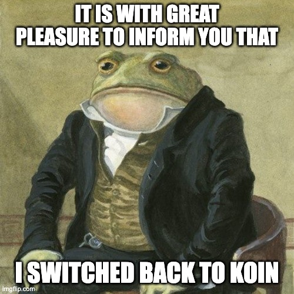

If you remember, last summer I wrote a
[technical article](2025-06-27-koin-vs-kodein-for-kmp-di.md){ target=_blank } about DI and why
our Raccoon apps, which had always used **Koin** from the beginning in 2023, were both migrated to
**Kodein** at the end of 2024.

!!! info "TL;DR"

    There was an issue with the 2.0.0-Beta version of Koin Annotation which broke reproducible builds,
    which blocked releases on F-Droid. I reported the issue but it remained unanswered and unnoticed
    for months.

## An unwanted Christmas present

A year and a half later, I still do not have good memories of that migration. I completed it around
the last week of December, and it was a bitter Christmas present. It just felt "wrong" in many ways.

In the first place, Kodein was not on the same level of completeness, and I had to manually write
some missing connectors, e.g. for `lifecycle-viewmodel`
integration. Secondly, I had to switch from a powerful annotation set to define bindings to manual
wiring, just as with Koin's classic DSL.

So I was left with all the advantages and disadvantages of a classic DSL-based service locator
(which apply both to Kodein and to Koin with the classic DSL):

| Feature                                |   |
|----------------------------------------|---|
| Multiplatform support                  | ✅ | 
| Flexibility (definition and call site) | ✅ |
| Conciseness                            | ❌ |
| Compile-time validation                | ❌ |
| Performance                            | ❌ |

Yes, it is true that this works seamlessly across all supported platforms (even if, as usual, the
iOS build was more complicated). It is also easy to integrate and flexible (perhaps excessively so,
considering it's possible to retrieve a dependency at whatever level of the architecture). On the
downside, manual wiring via DSL implies boilerplate, there is no compile time safety so missing
bindings result in runtime crashes and, last but not least, there's some overhead since resolution
only happens at runtime.

I could accept this as a temporary tradeoff in order to have reproducible builds back, but I was
keeping an eye on the Koin library evolution, waiting for the right moment to come back. And, as of
2026, that moment seems to have finally arrived.

<figure markdown="span">
  
</figure>

But, this time, it's done the "right way".

## Why a change was needed

### Technical considerations

As anticipated, there were some compromises. I had to accept maintaining a fair amount of
boilerplate (scattered along 50+ module definitions per project), because no matter how well-thought
DSLs are, you still have to manually wire components, i.e.:

- **Scoping:** define the lifetime of each component and scope it correctly;
- **Binding:** provide implementors using the qualifiers provided by the framework (typically a
  combination of type and names/tags);
- **Assisted injection:** deal with the cases when some constructor parameters are dynamically
  passed at runtime, while some others are provided by the framework itself.

I also had to give up on safety, i.e. not get compile time errors if the DI setup is incorrect,
e.g.:

- **Missing bindings:** some dependency is used somewhere, but it is defined nowhere;
- **Conflicting bindings:** there are multiple dependency definitions with the same qualifiers,
  leading to resolution ambiguity;
- **Cycles:** the DI graph needs to be acyclic, it is not possible to have direct or indirect
  recursion, i.e. it is not possible to require in order to instantiate a component anything
  requiring the component itself (potentially across multiple indirection levels)

Finally, there were some performance tradeoffs I had to accept: using the service locator pattern
implies that dependencies can only be resolved at runtime, with some inevitable overhead.

While these issues affect both Kodein and Koin, the latter has been maturing year after year and is
going towards a different direction, whereas the former has been stalling. Which leads towards a
second set of reasons why I was considering a change.

### Political considerations

There were increasingly worrying signals about how the KOSI project is maintained, detailed in the
public [Manifesto](https://medium.com/kodein-koders/moving-forward-with-the-kodein-open-source-initiative-9fc4f6160c84){ target=_blank } .

- **Development Bottleneck:** core maintainers operate as a commercial agency and explicitly shifted
  focus, reducing their open-source bandwidth;
- **Ecosystem Stagnation:** Secondary projects have been frozen rather than community-delegated.[^1]
- **Strict Governance:** the organization acts as a closed ecosystem to protect the corporate brand.
  Community pull requests are accepted only in isolation, and the project does not onboard
  independent co-maintainers (applications are denied in spite of workforce being needed to
  implement feature requests).
- **Architectural Stalling:** The project maintains an intentional distance from modern compilation
  features, such as compile-time verification.

Salomon Brys, one of the two core maintainers, publicly stated:

> we believe that compile-time verification is way to \[sic\] restrictive and leads to a lot of
> complications when we want to provide flexibility.

This sets them apart from the current industry trend towards increased compile-time safety.

## The migration steps

In our [RACCOON Code of Conduct](2025-06-08-contributing-to-raccoon-apps.md#our-code-of-conduct), the
last bit says "Never give up". Even when this implies taking difficult decisions. Every technical
challenge is an opportunity for improvement, experimenting and having fun.

Sometimes development, like life, moves in spirals rather than in a straight line and in order to
advance further a phase when it seems like you are going backwards may be required.

!!! tip

    In order to better understand the following, remember that DI is like a two-side coin (koin?):
    
    - **Definition Site:** where each component is scoped and bound; 
    - **Call Site:** where a component is required and accessed in client code.

The first step was migrating back from Kodein to the initial "classic DSL" Koin, where each use case
had almost a one-to-one equivalent[^2] at least at the definition site.

Secondly, I worked on cleaning up all the cruft, i.e. removing the "glue code" I had to
write to make up for what Kodein was lacking (Compose integration, `ViewModel` integration etc.),
which mostly was on the call site.

In the third place I migrated from the "classic DSL" to the new Compiler Plugin (KCP) DSL at the
definition site, which already added compile-time validation and performance: all dependencies were
determined and validated at compile time.

As a fourth step, again at the definition site, I migrated to annotations, in order to remove all
boilerplate and leverage component scanning and automatic wiring (e.g. when a class implements only
an interface the binding is automatically done).

## Final outcome

The result has the best of both worlds: the flexibility of a service locator, the safety of a
full-fledged DI framework.

| Feature                 |   |
|-------------------------|---|
| Multiplatform support   | ✅ | 
| Flexibility             | ✅ |
| Conciseness             | ✅ |
| Compile-time validation | ✅ |
| Performance             | ✅ |

Moreover, Koin has established itself as the leading framework for DI on KMP. It has extensive
documentation and tooling, and it is backed by an active group of users and maintainers and has
grown over time, showing maturity and openness towards community feedback.

## Lessons learned

I tend to be open-minded towards tools and I chose to use libraries like Koin and Kodein no matter
how much they were frowned upon. by my colleagues as professional Android developers (accustomed to
Dagger-Hilt safety and power); however I remember having thought my coworkers were probably right
when the problem hit.

I remember how angry I was when one single library was acting as a road blocker and preventing the
updates from being distributed on app stores, and I swore I would never go back to Koin in my life.

But, in the end, I appreciated the commitment of Arnaud and his team; I listened to him in person at
a KotlinConf some year ago, really impressive. I was really grateful for their listening to our
feedback, abandoning the old KSP approach (based on annotation processing and code generation) in
favor of the new KCP.

Changing one's mind is a sign of intelligence and maturity, and I had to change my mind with this
respect. Consider this the end, for now, of my concerns about DI in Raccoon.

[^1]: For example, the official [Kodein-DB](https://github.com/kosi-libs/Kodein-DB) repository has
been explicitly labeled as a "Project paused" with the caveat that it would not be maintained in its
current form.

[^2]: Except that Kodein has three ways of defining bindings: singleton (single instance), provider
(new instance each time, no arguments) and factory (new instance each time with assisted arguments);
whereas Koin has only two: single and factory (with or without arguments).

*[DSL]: Domain-Specific Language
*[DI]: Dependency Injection
*[KOSI]: Kodein Open Source Initiative
*[KCP]: Koin Compiler Plugin
*[KMP]: Kotlin Multiplatform
*[KSP]: Kotlin Symbol Processor