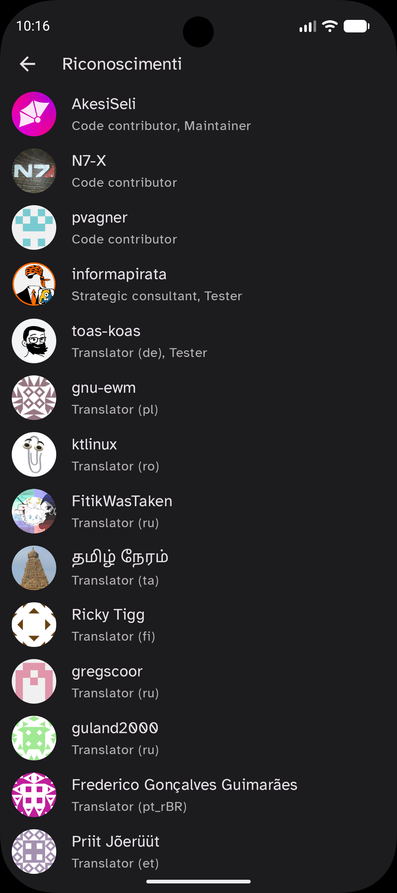
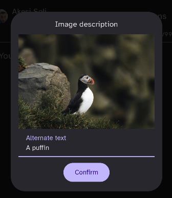
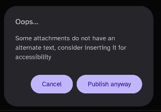

In English, there is this popular phrase "sharing is caring". For introverts, though, this often
remains something very difficult to apply in real life. For example, one may hesitate to offer
their work out of fear of being judged. Or, on the opposite side, one may find it difficult to
accept collaboration from others, wondering what they might expect in return.

Working on apps like _Raccoon-s_ (the Mastodon/Friendica client and the Lemmy one) was
an opportunity to put myself to test and see how I would cope with those situations.

In today's article we'll see what kinds of contributors the projects attracted and how each one of 
them not only shaped the apps themselves but also turned me, as the main developer, into a richer
person.

So let's start!

## Different types of contributors

To begin, my work exposed me to public criticism. Trust me, _a lot_ of criticism. Especially on
Lemmy, where users are known for not being excessively polite or diplomatic.

I must confess that I've not always reacted well to it; e.g. when I closed and reopened the
repository under a different organization (see
[What happened to Raccoon for Lemmy?](2025-06-17-what-happened-to-raccon-for-lemmy.md){ target=_blank }).

Nonetheless, when this happened, I was surprised to see that there were also people who genuinely
appreciated the project, some of them even volunteered to take ownership of it in case I decided
to discontinue it.

### 1. Developers

That leads to the first type of collaboration I got from people online. That moment of crisis, when
I was facing being harshly criticized for how a library I used rendered Markdown in August 2024, was
also the moment when I met [N7-X](https://github.com/N7-X){ target=_blank }.

He helped me immensely, both with Markdown rendering and in general with some design decisions I
am still applying today. I was impressed to see that someone (in another continent, with a totally
different background) wanted to collaborate with me to make the app better, expecting nothing in
return.

"Being impressed" is not even the right word, it was heartwarming. And I must admit it helped
me get through that difficult moment and find the energy not only to continue working on the project,
but also to start new ones.

### 2. Translators

Then there are translators. Before studying Computer Science and working as a software engineer,
I was in the professional translation industry.

!!! question

    Did you notice all apps had Italian and Spanish support from day zero?

This is why I've always been attentive to offer support for localization and to choose the right
tools to make localization easier for me as a maintainer and for translators.

Since I understand the struggles of localization, all translators are given credits in the
acknowledgements screen.

<figure markdown="span">
  { width=400 }
  <figcaption>A screenshot of the "Acknowledgements" screen.</figcaption>
</figure>

!!! tip

    Those who submitted translations in the
    [Weblate project](https://hosted.weblate.org/engage/raccoonforfriendica){ target=_blank } also
    reached out to me to provide feedback, talk about the future of the project, discover
    who was behind it, etc.

Receiving new translations or proofreads for existing ones was, again, a motivation boost and it
was surprising to see how people nearby (e.g., German or Romanian) and from far away (e.g., Tamil or
Brazilian Portuguese) wanted to help expand the user base.

### 3. Accessibility experts

When working on apps / websites professionally, there are legal requirements about accessibility
which must be met by all services (see earlier article about
[advanced a11y](2026-06-08-advanced-accessibility-in-cmp.md#accessibility-in-a-nutshell){ target=_blank }),
so it should be taken as a given.

In an open-source "pet project", though, accessibility can be much more discretionary. For Raccoon,
I remember making it the default behavior to open a dialog for alternative text and issuing a
warning when a post is about to be published with missing alt text.

<figure markdown="span">
  { width=250 }
  <figcaption>Dialog to insert the alt text each time an image is attached.</figcaption>
</figure>

<figure markdown="span">
  { width=300 }
  <figcaption>Warning shown when some image attachments are missing the alt text.</figcaption>
</figure>

Then, I was relying on Compose Multiplatform for the heavy lifting of integrating with accessibility 
tools, provided that the guidelines and best practices are being followed.

Until one day a lot of unexpected help came from [pvagner](https://github.com/pvagner), who helped
me understand some of the issues people using screen readers faced with the original timeline 
layout, fix them and avoid making the same mistakes again.

One of the purposes of the Fediverse is to create inclusive and diverse communities, and I guess 
this is also one of the reasons why we work on creating ecosystems for it.

Knowing that in some way I laid my brick to help build that was a sign that the direction is the 
right one and was a motivation booster for me personally.

### 4. Strategic advisors

The fourth kind of collaborators I met during my journey was what I would classify as "strategic
advisors". For example, while working on the Lemmy client, I met the administrators of
[feddit.it](https://feddit.it){ target=_blank } which is the largest Italian instance. 

One of them was the one who first talked to me about the 
[unique features of Friendica](2025-06-13-what-makes-friendica-shine.md){ target=_blank } and 
inspired me to create a new client for it.

This person also suggested emphasizing aspects such as rich text formatting and discussion
groups, which became one of the most distinctive features of the app compared to similar ones in the
open source ecosystem.

Engaging with this kind of input has always been a little challenging because it forced me to
question the scope of my work over and over again, adjust the strategy to constantly meet new
targets.

But, on the other side, I truly believe that what originates from a constructive discussion is
greater than the sum of the components involved. Moreover, having this kind of advisory helped
me to prioritize user requests and bug reports (see the next paragraph).

### 5. Feedback and bug reporters

Finally, there are the most common contributions an open-source project receives: feature requests
and bug reports.

Having to deal with these helped me to develop both social and planning skills, which are crucial
even in my professional job.

## Wrapping up

Working on open source projects can be daunting for introverts, but looking back, it was one of the
best decisions I made.

You have no idea how good it feels to create, little by little, something useful (hopefully) for 
myself and for others.

Plus, this was the occasion to open up to other people, share thoughts, and collaborate to create
something together in a period where individualism seems to dominate relationships.

In a word, I would say this felt like "healing" a little bit from the scars of life.

!!! note

    Want to know more about the project? Or, maybe, feel like contributing yourself?
    Have a look at our 
    [GitHub page](https://github.com/LiveFastEatTrashRaccoon/RaccoonForFriendica){ target=_blank }!